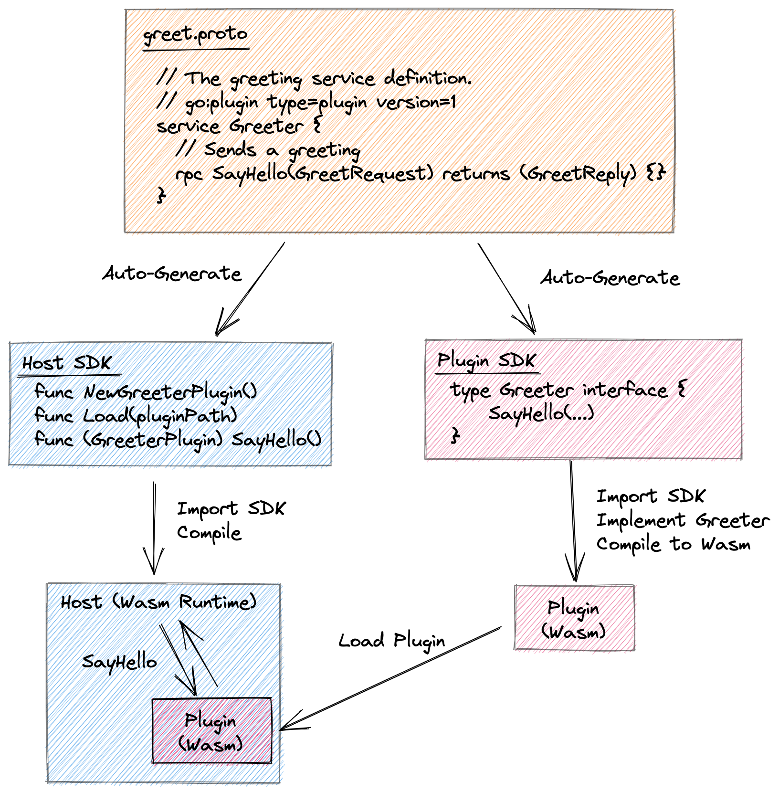

# Go Plugin System over WebAssembly


`go-plugin` is a Go (golang) plugin system over WebAssembly (abbreviated Wasm).
As a plugin is compiled to Wasm, it can be size-efficient, memory-safe, sandboxed and portable.
The plugin system auto-generates Go SDK for plugins from [Protocol Buffers][protobuf] files.
While it is powered by Wasm, plugin authors/users don't have to be aware of the Wasm specification since the raw Wasm APIs are capsulated by the SDK.

It is inspired by [hashicorp/go-plugin][hashicorp-go-plugin].

## Features
The Go plugin system supports a number of features:

**Auto-generated Go interfaces:** The plugin system generates Go code for hosts and plugins from Protocol Buffers files like gRPC.
It is easy to learn how to use `go-plugin` for protobuf/gRPC users.

**Plugins are Go interface implementations:** 
Raw Wasm APIs are hidden so that user can write and consume plugins naturally.
To a plugin author: you just implement an interface as if it were going to run in the same process.
For a plugin user: you just use and call functions on an interface as if it were in the same process.
This plugin system handles the communication in between.

**Safe:** Wasm describes a memory-safe, sandboxed execution environment.
Plugins cannot access filesystem and network unless hosts allow those operations.
Even 3rd-party plugins can be executed safely.
Plugins can't crash the host process as it is sandboxed.

**Portable:** Wasm is designed as a portable compilation target for programming languages.
Plugins compiled to Wasm can be used anywhere.
A plugin author doesn't have to distribute multi-arch binaries.

**Efficient:**
The Wasm stack machine is designed to be encoded in a size- and load-time-efficient binary format.

**Bidirectional communication:**
Wasm allows embedding host functions.
As Wasm restricts some capabilities such as network access for security, plugins can call host functions that explicitly embedded by a host to extend functionalities.

**Stdout/Stderr Syncing:**
Plugins can use stdout/stderr as usual and the output will get mirrored back to the host process.
The host process can control what io.Writer is attached to stdout/stderr of plugins.

**Protocol Versioning:**
A very basic "protocol version" is supported that can be incremented to invalidate any previous plugins.
This is useful when interface signatures are changing, protocol level changes are necessary, etc.
When a protocol version is incompatible, a human friendly error message is shown to the end user.

## Architecture
`go-plugin` generates Go SDK for a host and TinyGo SDK for plugins.
As the Wasm support in Go is not mature, plugins need to be compiled to Wasm by [TinyGo][tinygo], which is an alternative compile for Go source code, at the moment.
The plugin system works by loading the Wasm file and communicating over exporting/exported methods.

This architecture has a number of benefits:

- Plugins can't crash your host process: a panic in a plugin is handled by the Wasm runtime and doesn't panic the plugin user.
- Plugins are very easy to write: just write a Go application and `tinygo build`.
- Plugins are very easy to distribute: just compile the TinyGo source code to the Wasm binary once and distribute it.
- Plugins are very easy to install: just put the Wasm binary in a location where the host will find it.
- Plugins can be secure: the plugin is executed in a sandbox and doesn't have access to the local filesystem and network by default.

## Installation

Download a binary here.

## Usage
To use the plugin system, you must take the following steps.
These are high-level steps that must be done.
Examples are available in the `examples/` directory.

1. Choose the interface(s) you want to expose for plugins.
    - Define [Messages][protobuf-message] and [Services][protobuf-service] in a proto file.
1. Generate SDK for a host and plugin by `go-plugin`.
1. Implement the Go interface defined in the plugin SDK.
1. Compile your plugin to Wasm.
1. Load the plugin and call the defined methods.

The development flow is as below.



## Tutorial
Let's create a hello-world plugin.

### Prerequisite
Install the following tools:

- `knqyf263/go-plugin` (See `Installation`)
- [protoc][protoc]
- [TinyGo][tinygo-installation]

### Choose the interface you want to expose for plugins
Create `greeting.proto`.

```protobuf
syntax = "proto3";
package greeting;

option go_package = "github.com/knqyf263/go-plugin/examples/helloworld/greeting";

// The greeting service definition.
// go:plugin type=plugin version=1
service Greeter {
  // Sends a greeting
  rpc SayHello(GreetRequest) returns (GreetReply) {}
}

// The request message containing the user's name.
message GreetRequest {
  string name = 1;
}

// The reply message containing the greetings
message GreetReply {
  string message = 1;
}
```

Most of the definitions are simply as per [the Protocol Buffers specification][protobuf-spec].
The only difference is the line starting with `// go:plugin`.
It defines parameters for `go-plugin`.
`type=plugin` means the service defines the plugin interface.

### Generate SDK
Run the following command.

```shell
$ protoc --go-plugin_out=. --go-plugin_opt=paths=source_relative greeting.proto
```

Then, you will find 4 files generated in the same directory, `greet.pb.go`, `greet_host.pb.go`, `greet_plugin.pb.go` and `greet_vtproto.pb.go`.

### Implement a plugin
The `Greeter` interface is generated as below in the previous step. 

```go
type Greeter interface {
	SayHello(context.Context, GreetRequest) (GreetReply, error)
}
```

A plugin author needs to implement `Greeter` and registers the struct via `RegisterGreeter`.
In this tutorial, we use `plugin.go` as a file name, but it doesn't matter.

```go
//go:build tinygo.wasm

package main

import (
	"context"

	"github.com/path/to/your/greeting"
)

// main is required for TinyGo to compile to Wasm.
func main() {
	greeting.RegisterGreeter(MyPlugin{})

}

type MyPlugin struct{}

func (m MyPlugin) SayHello(ctx context.Context, request greeting.GreetRequest) (greeting.GreetReply, error) {
	return greeting.GreetReply{
		Message: "Hello, " + request.GetName(),
	}, nil
}
```

Then, compile it to Wasm by TinyGo.

```shell
$ tinygo build -o plugin.wasm -scheduler=none -target=wasi --no-debug plugin.go
```

### Implement a host
Load the plugin binary and call `SayHello`.

```go
package main

import (
	"context"
	"fmt"
	"log"

	"github.com/path/to/your/greeting"
)

func main() {
	ctx := context.Background()
	
	// Initialize a plugin loader
	p, err := greeting.NewGreeterPlugin(ctx, greeting.GreeterPluginOption{})
	if err != nil {...}

	// Load a plugin
	plugin, err := p.Load(ctx, "path/to/plugin.wasm")
	if err != nil {...}

	// Call SayHello
	reply, err := plugin.SayHello(ctx, greeting.GreetRequest{Name: "go-plugin"})
	if err != nil {...}
	
	// Display the reply
	fmt.Println(reply.GetMessage())
}
```

### Run

```shell
$ go run main.go
Hello, go-plugin
```

That's it! It is easy and intuitive.
You can see the `hello-world` example [here][hello-world].

## References
### Host functions
Wasm has limited capability as it is secure by design, but those can't be achieved with Wasm itself.
To expand the capability, many compilers implement system calls using WebAssembly System Interface ([WASI][wasi]).
But it is still draft ([wasi_snapshot_preview1][wasi_snapshot_preview1]) and some functions are not implemented yet in [wazero][wazero] that `go-plugin` uses for Wasm runtime.
For example, `sock_recv` and `sock_send` are not supported for now.
It means plugins don't have network access.

Host functions can be used for this purpose.
A host function is a function expressed outside WebAssembly but passed to a plugin as an import.
You can define functions in your host and pass them to plugins so that plugins can call the functions.
Even though Wasm itself doesn't have network access, you can embed such function to plugins.

You can define a service for host functions in a proto file.
Note that `// go:plugin type=host` is necessary so that `go-plugin` recognizes the service is for host functions.
The service name is `HostFunctions` in this example, but it doesn't matter.

```protobuf
// go:plugin type=host
service HostFunctions {
  // Sends a HTTP GET request
  rpc HttpGet(HttpGetRequest) returns (HttpGetResponse) {}
}
```

**NOTE:** the service for host functions must be defined in the same file where other plugin services are defined.

Let's say `Greeter` is defined in the same file as `HostFunctions`.
Then, `Load()` will be able to take `HostFunctions` as an argument as mentioned later.

```protobuf
// go:plugin type=plugin version=1
service Greeter {
  rpc SayHello(GreetRequest) returns (GreetReply) {}
}
```

`go-plugin` generates the corresponding Go interface as below.

```go
// go:plugin type=host
type HostFunctions interface {
    HttpGet(context.Context, HttpGetRequest) (HttpGetResponse, error)
}
```

Implement the interface.

```go
// myHostFunctions implements HostFunctions
type myHostFunctions struct{}

// HttpGet is embedded into the plugin and can be called by the plugin.
func (myHostFunctions) HttpGet(ctx context.Context, request greeting.HttpGetRequest) (greeting.HttpGetResponse, error) {
    ...
}
```

And pass it when loading a plugin.
As described above, `Load()` takes the `HostFunctions` interface.

```go
greetingPlugin, err := p.Load(ctx, "plugin/plugin.wasm", myHostFunctions{})
```

Now, plugins can call `HttpGet()`.
You can see an example [here][host-functions-example].

### Define an interface version
You can define an interface version in the `// go:plugin` line.

```protobuf
// go:plugin type=plugin version=2
service Greeter {
  // Sends a greeting
  rpc Greet(GreetRequest) returns (GreetReply) {}
}
```

This is useful when interface signatures are changing. 
When an interface version is incompatible, a human friendly error message is shown to the end user like the following.

```shell
API version mismatch, host: 2, plugin: 1
```

## Tips
### File access
Refer to [this example][wasi-example].

### JSON parsing
TinyGo currently doesn't support `encoding/json`.
https://tinygo.org/docs/reference/lang-support/stdlib/

You have to use third-party JSON libraries such as [gjson][gjson] and [easyjson][easyjson].

Also, you can export a host function. The example is available [here][json-example].

### Logging
`fmt.Printf` can be used in plugins if you attach `os.Stdout` as below. See [the example][wasi-example] for more details.

```Go
p, err := cat.NewFileCatPlugin(ctx, cat.FileCatPluginOption{
	Stdout: os.Stdout, // Attach stdout so that the plugin can write outputs to stdout
	Stderr: os.Stderr, // Attach stderr so that the plugin can write errors to stderr
})
```

If you need structured and leveled logging, you can define host functions so that plugins can call those logging functions.

```protobuf
// The host functions embedded into the plugin
// go:plugin type=host
service LoggingFunctions {
  // Debug log
  rpc Debug(LogMessage) returns (google.protobuf.Empty) {}
  // Info log
  rpc Info(LogMessage) returns (google.protobuf.Empty) {}
  // Warn log
  rpc Info(LogMessage) returns (google.protobuf.Empty) {}
  // Error log
  rpc Error(LogMessage) returns (google.protobuf.Empty) {}
}
```

### Plugin distribution
A plugin author can use OCI registries such as GitHub Container registry (GHCR) to distribute plugins.

Push:

```shell
$ oras push ghcr.io/knqyf263/my-plugin:latest plugin.wasm:application/vnd.module.wasm.content.layer.v1+wasm
```

Pull:

```shell
$ oras pull ghcr.io/knqyf263/my-plugin:latest
```

### Other TinyGo tips
You can refer to https://wazero.io/languages/tinygo/.

## Under the hood
`go-plugin` uses [wazero][wazero] for Wasm runtime.
Also, it customizes [protobuf-go][protobuf-go] and [vtprotobuf][vtprotobuf] for generating Go code from proto files.

## Q&A
### Why not hashicorp/go-plugin?
Launching a plugin as a subprocess is not secure.
In addition, plugin authors need to distribute multi-arch binaries.

### Why not [the official `plugin` package][plugin]?
It is not schema-driven like Protocol Buffers and can easily break signature.

### Why not using [protobuf-go][protobuf-go] directly?

TinyGo [doesn't support Protocol Buffers](https://github.com/tinygo-org/tinygo/issues/2667) natively as of today.
`go-plugin` generates Go code differently from [protobuf-go] so that TinyGo can compile it.

### Why replacing known types with custom ones?
You might be aware that your generated code imports [github.com/knqyf263/go-plugin/types/known][go-plugin-known], not [github.com/protocolbuffers/protobuf-go/types/known][protobuf-go-known] when you import types from `google/protobuf/xxx.proto` (a.k.a well-known types) in your proto file.
As described above, `TinyGo` cannot compile `github.com/protocolbuffers/protobuf-go/types/known` since those types use reflection.
`go-plugin` provides well-known types compatible with TinyGo and use them.

### Why using `// go:plugin` for parameters rather than [protobuf extensions][protobuf-extensions]?
An extension must be registered in [Protobuf Global Extension Registry][protobuf-registry] to issue a unique extension number.
Even after that, users needs to download a proto file for the extension.
It is inconvenient for users and the use case in `go-plugin` is simple enough, so I decided to use comments.

### Why not supporting Go for plugins?
Go doesn't support [WASI][wasi].
You can see other reasons [here][wazero-go].
We might be able to add support for Go as an experimental feature.

### What about other languages?
`go-plugin` currently supports TinyGo plugins only, but technically, any language that can be compiled into Wasm can be supported.
Welcome your contribution :)

## TODO

- Specification
  - [x] Packages
  - [x] Messages
    - [x] Nested Types
  - [x] Fields
    - [x] Singular Message Fields  
      - [x] double  
      - [x] float  
      - [x] int32  
      - [x] int64  
      - [x] uint32  
      - [x] uint64  
      - [x] sint32  
      - [x] sint64  
      - [x] fixed32  
      - [x] fixed64  
      - [x] sfixed32  
      - [x] sfixed64  
      - [x] bool  
      - [x] string  
      - [x] bytes  
    - [x] Repeated Fields  
    - [x] Map Fields  
    - Oneof Fields (not planned)
  - [x] Enumerations
  - Extensions (not planned)
  - [x] Services
- [ ] Well-known types
  - [x] Any (Some functions/methods are not yet implemented)
  - [ ] Api
  - [x] BoolValue
  - [x] BytesValue
  - [x] DoubleValue
  - [x] Duration
  - [x] Empty
  - [x] Enum
  - [x] EnumValue
  - [x] Field
  - [x] Field_Cardinality
  - [x] Field_Kind
  - [ ] FieldMask
  - [x] FloatValue
  - [x] Int32Value
  - [x] Int64Value
  - [x] ListValue
  - [ ] Method
  - [ ] Mixin
  - [x] NullValue
  - [x] Option
  - [x] SourceContext
  - [x] StringValue
  - [x] Struct
  - [x] Syntax
  - [x] Timestamp
  - [x] Type
  - [x] UInt32Value
  - [x] UInt64Value
  - [x] Value
- [x] Generate codes
  - [x] Structs without reflection
  - [x] Marshaling/Unmarshaling
  - [x] Host code calling plugins
  - [x] Plugin code called by host
  - [x] Interface version
  - [x] Host functions


[protobuf]: https://developers.google.com/protocol-buffers/docs/overview
[protobuf-message]: https://developers.google.com/protocol-buffers/docs/proto3#simple
[protobuf-service]: https://developers.google.com/protocol-buffers/docs/proto3#services
[protobuf-spec]: https://developers.google.com/protocol-buffers/docs/proto3
[protobuf-extensions]: https://developers.google.com/protocol-buffers/docs/proto#extensions
[protobuf-registry]: https://github.com/protocolbuffers/protobuf/blob/main/docs/options.md

[wazero]: https://github.com/tetratelabs/wazero
[hashicorp-go-plugin]: https://github.com/hashicorp/go-plugin
[protoc]: https://grpc.io/docs/protoc-installation/
[vtprotobuf]: https://github.com/planetscale/vtprotobuf
[plugin]: https://pkg.go.dev/plugin
[gjson]: https://github.com/tidwall/gjson
[easyjson]: https://github.com/mailru/easyjson

[protobuf-go]: https://github.com/protocolbuffers/protobuf-go
[protobuf-go-known]: https://github.com/protocolbuffers/protobuf-go/tree/master/types/known

[tinygo]: https://tinygo.org/
[tinygo-installation]: https://tinygo.org/getting-started/install/

[hello-world]: https://github.com/knqyf263/go-plugin/tree/1ebeeca373affc319802989c0fe6304f014861c4/examples/helloworld
[go-plugin-known]: https://github.com/knqyf263/go-plugin/tree/1ebeeca373affc319802989c0fe6304f014861c4/types/known

[wasi]: https://github.com/WebAssembly/WASI
[wasi_snapshot_preview1]: https://github.com/WebAssembly/WASI/blob/snapshot-01/phases/snapshot/docs.md

[wasi-example]: https://github.com/knqyf263/go-plugin/tree/main/examples/wasi
[host-functions-example]: https://github.com/knqyf263/go-plugin/tree/main/examples/host-functions
[json-example]: https://github.com/knqyf263/go-plugin/tree/main/tests/host-functions

[wazero-go]: https://wazero.io/languages/go/